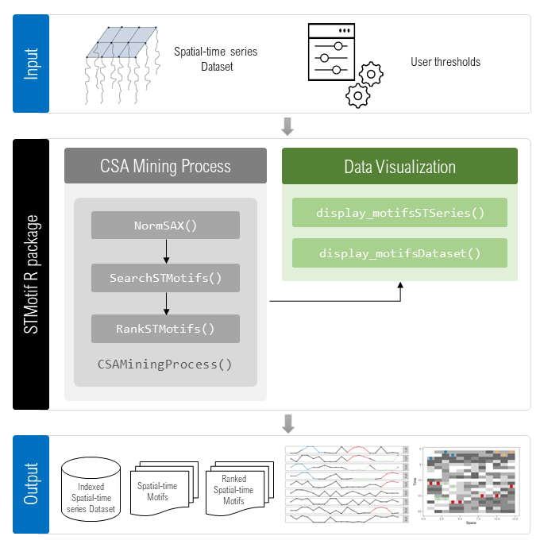

This document is an auxiliary Markdown adaptation of the legacy LaTeX manuscript in `DEL-StMotifPackage`. It follows the JOSS manuscript style at the file level, but preserves the original section structure and technical content so it can serve as reference material while `paper.md` is being refined.

# Motivation and significance

Many phenomena can be registered and organized chronologically as time series [@shumway_time_2017]. Some time series have position associated, characterizing what is known as spatial-time series [@atkinson_gis_2000]. Various important time series phenomena present different behavior when observed in space and time, for example series collected by sensors and IoT devices [@fu_review_2011].

Commonly, the overall properties of a series may be of little relevance, and the interest of researchers may be restricted to small parts of it, known as subsequences [@chiu_probabilistic_2003]. These subsequences may correspond to patterns as long as they occur in the time series at a reasonable frequency [@ding_querying_2008].

In the literature, patterns from time series data that are previously unknown and occur frequently are known as motifs [@lin_finding_2002]. An important task to enable the discovery of motifs is to check whether a given subsequence is similar to another [@lin_finding_2002].

Many recently developed works regarding time series motif discovery present novel techniques, methods, and algorithms targeting time series analysis [@mueen_time_2014; @serra_particle_2016; @torkamani_survey_2017; @yeh_time_2018]. Despite that, in spatial-time series datasets, these patterns may not be significantly present in a single time series but spread across multiple series. Finding these motifs, particularly emphasizing those constrained in space and time, is a challenging data mining task.

This work presents **STMotif**, an R package for spatial-time series motif discovery. It is developed to address the challenge of identifying regions of space and time where motifs are frequently observed. Its goal is to discover and classify motifs within the spatial-time series context. It is based on the Combined Series Approach (CSA) [@borges_spatial-time_2020], the first method to present a complete approach for motif discovery in spatial-time series. The package allows the user not only to find motifs but also to rank and visualize them.

STMotif is therefore a useful tool for finding and visually inspecting motifs constrained in space and time. It may be applied, for example, to seismic data and the movement of ocean currents.

# Software description

In this section, we present some time series definitions. Then we detail the method, architecture, and functionalities of the package.

## Time series background

A time series $t$ is a sequence of observations $t = \langle t_1, t_2, \dots, t_m \rangle$, where $t_i \in \mathbb{R}$. In $t$, each $t_i$ is a value, $|t| = m$ is the number of elements, and $t_m$ is the most recent value [@shumway_time_2017].

The $p$-th subsequence of $t$ of length $n$ is represented as $seq_{n,p}(t)$. It is an ordered sequence of values $\langle t_p, t_{p+1}, \dots, t_{p+n-1} \rangle$, where $|seq_{n,p}(t)| = n$ and $1 \le p \le |t| - n$.

A sliding window $sw_n(t)$ produces a matrix $W$ of size $(|t| - n + 1) \times n$. Each row $w_i$ in $W$ is the $i$-th subsequence of size $n$ from $t$. In this way, for a given $W = sw_n(t)$, $\forall w_i \in W$, a row $w_i$ is represented as $w_i = seq_{n,i}(t)$ [@borges_spatial-time_2020].

A sequence $q$ of length $|q|$, also known as word size, is a motif in a time series $t$ if and only if it has a minimum number of occurrences ($\sigma$). Formally, given a sequence $q$ and a time series $t$ where $W = sw_{|q|}(t)$, $motif(q, t, \sigma) \leftrightarrow \exists R \subseteq W$, with $|R| \ge \sigma$, such that $\forall w_i \in R$, $w_i = q$ [@mueen_time_2014].

A pair $(t, p)$, in which a time series $t$ is associated with a position $p$, is called a spatial-time series $st$ [@shekhar_spatial_2016]. A dataset of spatial-time series is a set of spatial-time series, such that $D = \{(t_j, p_j)\}$.

## The method

Motif discovery proposes identifying frequent unknown patterns in real numeric-valued time series. In a time series context, data is usually a sequence of real-valued numbers, which is inefficient in the motif discovery process. It limits motif discovery since the probability of observing any specific real number is close to zero [@lin_experiencing_2007].

To deal with this problem, STMotif applies the SAX indexing technique [@lin_experiencing_2007]. SAX allows lower bounding of Euclidean distance and produces symbolic representations of time series with approximately equiprobable symbols, taking linear time to process.

The first step consists of normalizing values from a dataset using the z-score method [@keogh_exact_2005]. The data is then divided into equal-sized ranges. Thus, we can determine the breakpoints that will produce an equal-sized range associated with a specific symbol from an alphabet of size $a$.

The indexed spatial-time series dataset ($DS$) is partitioned into blocks ($B$) based on spatial block size ($sb$) and temporal block size ($tb$). Each corresponds, respectively, to the number of neighboring spatial-time series inside each block and to the time interval for subsequences of spatial-time series.

Considering $B$ as the partition of $DS$ into a set of blocks $\{b_{i,j}\}$, each block $b_{i,j}$ contains $sb \cdot tb$ observations, for all $i \in [1, \frac{|st.t|}{tb}]$ and all $j \in [1, \frac{|S|}{sb}]$. Each block $b_{i,j}$ contains $sb$ subsequences $\{q_k\}$, such that $q_k = seq_{tb,(i-1)\cdot(tb)+1}(S_{(j-1)\cdot sb + k}.t)$ for all $k \in [1, sb]$. All sequences inside a block are combined into a single time series $cs$, such that $cs$ is the concatenation of the sequences inside the block $b_{i,j}$. Formally, $cs = q_1 \Vert \cdots \Vert q_k$ and $|cs| = \sum_{i=1}^{k}|q_i| = sb \cdot tb$ [@borges_spatial-time_2020].

In the motif discovery step, all subsequences of size $w$ in $cs$ are examined using an algorithm for time series motif identification. This algorithm applies a hash function to register the positions of each individual subsequence $s_i$. If the number of occurrences of $s_i$ is greater than the minimum number of occurrences inside each block ($\sigma$), it becomes a candidate motif. The algorithm also validates the number of distinct spatial-time series. It checks whether the occurrence of $s_i$ is greater than or equal to the minimum number of spatial-time series with occurrences inside each block ($\kappa$). When both $\sigma$ and $\kappa$ conditions are satisfied, the sequence is considered a spatial-temporal motif [@borges_spatial-time_2020].

After the motif discovery step, many spatial-temporal motifs can be returned. The motif ranking step sorts motifs according to three criteria: (i) higher occurrence counts are better; (ii) occurrences closer to one another are better than those sparsely distributed in the dataset; and (iii) higher-entropy motifs are more interesting since they contain more information.

The sequences of SAX observations that occur in neighboring blocks are grouped. Then, ranking metrics for each group of motifs are computed, considering that the higher the entropy, the higher the information that the motif encodes. The entropy of a motif of size $w$ is computed based on information theory using the frequency table for the characters present in the motif.

For the set of occurrences of a motif discovered in neighboring blocks, the distance between all pairs of position and time is represented as an adjacent weighted matrix. Then, the minimum spanning tree is built from the adjacent weighted matrix. Finally, the average edge weight of the minimum spanning tree is computed. The reciprocal measure of this average weight is established. The closer this value is to $1$, the closer the occurrences are to establishing a spatial-temporal pattern.

The ranking procedure is applied once the computed values of entropy, occurrence count, and proximity are available. The balance among these dimensions is obtained using min-max normalization and projecting them into a combining unit vector. The closer the projection of a motif $m_i$ is to $(1, 1, 1)$, the better ranked it is.

The CSA mining process starts with normalization and SAX indexing of the numerical dataset $D$ for an alphabet size $a$, obtaining the dataset $DS$. It then partitions $DS$ into blocks based on the spatial block size $sb$ and the temporal block size $tb$, combines them, and applies the motif discovery algorithm for each subsequence of size $w$, respecting a minimum number of occurrences $\sigma$ and a minimum number of spatial-time series with occurrences $\kappa$, both inside each block. This step returns the list of motifs found. Then, constraints are aggregated and validated, and the motifs are ranked.

Algorithmic summary of the CSA mining process:

1. **Step 1**: normalization and SAX indexing.
2. **Step 2**: partition of spatial-time series.
3. **Step 3**: combination of blocked series and motif discovery.
4. **Step 4**: aggregation and validation of constraints.
5. **Step 5**: ranking of spatial-time motifs.

Output: ranked motifs.

# Description of the STMotif package

The tools of the STMotif package are offered to the user in the form of functions. Each one needs parameters. Some are data or thresholds defined by the user (`D`, `w`, `a`, `sb`, `tb`, `sigma`, and `kappa`). Others are outputs of previous function calls (`DS`, `stmotifs`, and `rstmotifs`) that can be used as input to other functions.

Although there are no implementation restrictions to the values of each parameter, it is important to understand the relationship between them and observe that defining some values for one parameter can restrict the possible values for others.

For example, it does not make sense to define `w` greater than `tb`, as it is not possible to find a subsequence whose size exceeds the temporal block size. For the parameters `sigma` and `kappa`, values in the range $[2, tb / w]$ are acceptable.

The implemented algorithm in this package allows users to set spatial block size (`sb`) and temporal block size (`tb`) constraints. Lower values for such constraints lead to identification of many non-useful frequent sequences. Higher values detect a smaller number of motifs that may become too small to be interesting, depending on the dataset domain.

Figure 1 shows the functionalities of the STMotif package, such as finding, ranking, and visualizing motifs, their inputs (data and thresholds), and possible outputs (motifs found and ranked, and graphics where the found motifs can be seen). The functions available in STMotif are described below.



- `NormSAX()` is responsible for applying normalization and SAX indexing. It receives as input the numeric dataset `D` and the size of the alphabet `a`, giving as output the normalized and indexed dataset `DS`.
- `SearchSTMotifs()` searches for motifs. This function receives as input the parameters `D`, `DS`, `w`, `a`, `sb`, `tb`, `sigma`, and `kappa`. It uses the normalized and indexed dataset `DS` to search for motifs and returns a list of motifs found.
- `RankSTMotifs()` takes the motifs found and ranks them. It gives as output the ranked motifs.

The entire CSA mining process can be achieved by making a single function call instead of the three previous ones:

- `CSAMiningProcess()` provides a compact way to perform normalization, SAX indexing, motif discovery, and ranking. The function returns the motifs ordered according to the computed rank. It consists of the whole CSA discovery and classification process.

As the analyzed dataset increases, the number of identified motifs tends to become larger. The mining process generates a large amount of data to analyze, which can be difficult to understand using only numerical analysis. Data visualization is therefore essential for analyzing and understanding results and for deriving meaningful insights. The STMotif package provides two functions for displaying data to better understand the discovered motifs. Both functions return a `ggplot` object from the `ggplot2` package.

- `display_motifsSTSeries()` receives as input `D`, `rstmotifs`, and `position` and returns a graphical representation of the motifs and their behavior in a column range.
- `display_motifsDataset()` requires as input `D`, `rstmotifs`, and `a`, and returns a view of value intensity with motif highlighting.

# Illustrative example

For a better understanding of the STMotif package and its functionalities, this section presents an example experimental setup for spatial-time motif discovery that can also be applied to real datasets.

The STMotif package is available on CRAN and can be installed and loaded as follows:

```r
install.packages("STMotif")
library(STMotif)
```

As an example of motif discovery and ranking, a synthetic spatial-time dataset is used to make the problem and the implemented approach easier to understand.

The data in this example contains thirty-six spatial-time series arranged in columns, each with forty observations over time. Each spatial-time series has an associated position, so sequential ordering indicates spatial location, where, for example, `ST2` is equally close to `ST1` and `ST3`.

We start with the `NormSAX()` function to apply z-score data normalization and, right after, SAX indexing with an alphabet of size `5`. In this process, values are replaced by letters from the set `{a, b, c, d, e}`, so central values are replaced by `c`, lower values by `a`, and higher values by `e`. Figure 2 shows a representation of some of the time series. The following code loads the dataset and calls `NormSAX()`:

```r
load("toy_dataset.RData") # loads D (40 by 36) array
DS <- NormSAX(D, a = 5)
```


Having the normalized and indexed data, we are ready to search the spatial-time motifs. The second main step in the CSA approach is implemented in the function `SearchSTMotifs()`. The function call, with the respective parameters, is as follows:

```r
stmotifs <- SearchSTMotifs(
  D, DS,
  w = 4, a = 5, sb = 9, tb = 10, sigma = 3, kappa = 2
)
```

Parameters `sb` and `tb` determine the block size created in the synthetic spatial-time dataset `D`. With `sb = 9` and `tb = 10`, sixteen blocks are created, each containing nine spatial-time series with ten observations in time. For each block, CSA generates all subsequences of size `w = 4` and validates them by the thresholds. If the number of occurrences of each sequence is greater than `sigma` and the number of distinct series from which the sequence appears is greater than or equal to `kappa`, the sequence is considered a motif inside a block. Considering neighboring blocks with boundaries between them, motifs are grouped with neighbors when they have the same SAX indexing. After executing `SearchSTMotifs()`, the identified motifs can be listed as follows:

```r
names(stmotifs)
[1] "ceeb" "bded" "baba" "baba" "baba" "baba"
```

The result of `SearchSTMotifs()` is a `stmotif` object, a data structure where each row represents a group of motifs with the same SAX indexing. It is important to note that in the resulting motif list, `"baba"` appears four times. This repetition happens because these groups belong to blocks with no neighborhood relation and therefore are not merged.

The number of discovered motifs can be high, especially when analyzing large datasets, and several of them may not be useful. The package also provides a function to rank the best motifs:

```r
rstmotifs <- RankSTMotifs(stmotifs)
```

The function `RankSTMotifs()` ranks motif groups based on entropy, number of occurrences, and proximity of their occurrences. As a result, the motifs from the `stmotif` list are ordered. Details of the ranked motifs can be seen as follows:

```r
sapply(rstmotifs, function(x) round(as.data.frame(x$rank), 2))
     [,1] [,2] [,3] [,4] [,5] [,6]
dist 0.71 0.71 0.95 1.00 0.78 0.71
word 1.50 1.50 1.00 1.00 1.00 1.00
qty  4.75 4.46 4.70 3.00 3.00 2.81
proj 1.43 1.31 1.27 0.78 0.25 0.00
```

The function `display_motifsSTSeries()` provides a way to visualize the spatial-time series, highlighting where each selected motif group appears and their shapes with different colors. The call is as follows:

```r
display_motifsSTSeries(D, rstmotifs, space = c(1:9))
```

In this example, we use the synthetic dataset `D` and the list of ranked motifs `rstmotifs`. The ordering of the spatial-time series represents their spatial location.

Figure 3 shows the plot of the spatial-time series from `ST1` to `ST9` and highlights the motif groups. Since the CSA mining process uses a SAX-indexed dataset, the real numerical values of the motifs may differ even when they share the same symbolic representation.


Another way to represent and visualize the results is through a heat map based on the SAX-encoded values using grayscale. The function `display_motifsDataset()` plots the intensity of the encoded dataset and the occurrences of the selected motif groups with different colors.

```r
display_motifsDataset(D, rstmotifs, a = 5)
```

In this example, we use the synthetic dataset `D`, an alphabet of size `5`, and the list of ranked motifs `rstmotifs` returned by the mining pipeline. Figure 4 shows the plot of the spatial-time series and highlights the motif groups (`"ceeb"`, `"bded"`, and four occurrences of `"baba"`). The grayscale represents the SAX symbolic gradation of the synthetic dataset. Each motif instance is presented in a different color in its corresponding position. This graphic allows analysis of the spatial-temporal distribution of the identified motifs.


After running the CSA mining process with the defined parameters, some motifs are found that would not be identified when applying traditional motif discovery methods independently to each spatial-time series [@borges_spatial-time_2020]. From Figure 4, different types of motifs can be observed together with their distribution.

Motifs marked in red with SAX value `"ceeb"` occur over a sizable horizontal range of the dataset, which indicates stronger temporal restriction. This type of pattern would not be found by traditional methods that analyze each series separately. Motifs presented in blue, with SAX value `"baba"`, happen in a more vertical range and are therefore more spatially restricted. The motifs shown in orange, with SAX value `"bded"`, and in green, with SAX value `"baba"`, each present a form that is restricted both spatially and temporally. Visualization is thus a useful complement for observing patterns and obtaining insights about them.

# Impact and conclusions

This work presents STMotif, an R package developed to discover, classify, and visualize motifs within the context of spatial-time series. The package uses CSA, extending beyond traditional techniques for the treatment of spatial-time series. It is the first package capable of finding motifs constrained in space and time. It also provides visual tools that allow the user to observe motif occurrences directly.

# Acknowledgements

The authors thank CAPES (finance code 001), CNPq, and FAPERJ for partially funding this research.

# References
