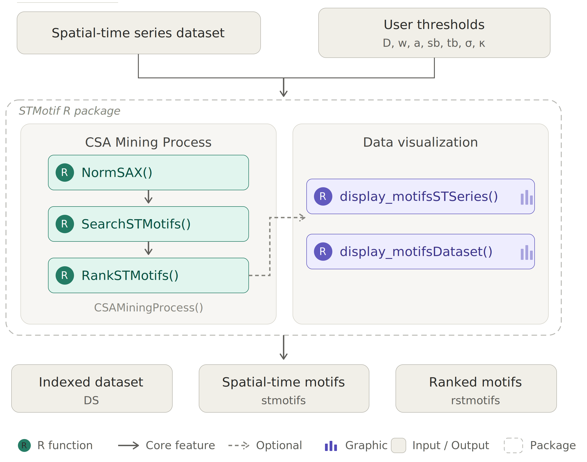

# Summary

**STMotif** is an R package for discovering, ranking, and visualizing frequent patterns, called motifs, in **spatial-time series**. Unlike traditional motif discovery tools that analyze each time series independently, STMotif targets patterns that are constrained simultaneously in space and time and may emerge only when neighboring series are analyzed jointly. The package implements the **Combined Series Approach (CSA)** introduced by @borges_spatial-time_2020 and provides end-to-end support for normalization, SAX encoding, constrained motif search, multi-criteria ranking, and visual inspection of the resulting motifs, all accessible through a small set of composable R functions.

# Statement of need

Many real-world phenomena can be represented as time series, and some of them are naturally associated with spatial position, producing spatial-time series datasets [@shumway_time_2017; @atkinson_gis_2000]. Examples include sensor networks, environmental monitoring, ocean currents, seismic data, and other geo-referenced temporal observations [@fu_review_2011]. In these scenarios, relevant patterns may not be strongly expressed in a single series, but rather distributed across multiple neighboring series.

A motif is a subsequence that appears frequently in time series [@torkamani_survey_2017; @linardi_matrix_2020]. Motif discovery aims to identify previously unknown and recurrent subsequences in time series [@lin_finding_2002; @mueen_time_2014]. Existing research has produced important advances in motif discovery algorithms and representations [@torkamani_survey_2017; @yeh_time_2018], but these methods mainly focus on single-series analysis. This creates a gap for applications in which the pattern of interest is both temporally localized and spatially distributed.

STMotif addresses this gap by providing a software implementation tailored to **motifs constrained in space and time**. The package is intended for researchers and practitioners who need to identify recurrent spatiotemporal patterns, rank them according to informative criteria, and inspect them visually in the original data. The main audience includes users working with georeferenced temporal data such as sensor networks, environmental monitoring, and related spatial analytics applications.

# State of the field

Traditional motif discovery methods generally assume that the input is a single series or a collection of series analyzed separately, analyzing only the temporal dimension. The CSA method proposed by @borges_spatial-time_2020 extends this perspective by partitioning a spatial-time dataset into spatial and temporal blocks, combining the observations within each block, and then searching for motifs that satisfy both occurrence and spatial-distribution constraints.

STMotif operationalizes this method in software and, to our knowledge, is the first R package focused on motif discovery under joint spatial and temporal constraints. This is therefore not a repackaging of an existing workflow: the contribution is the software realization of a distinct spatial-time motif mining method together with its ranking and visualization pipeline.

# Software design

STMotif is organized as a pipeline that separates symbolic preprocessing, constrained motif search, ranking, and visualization, as illustrated in \autoref{fig:pipeline}. Each stage can be invoked independently, so that intermediate outputs — such as the SAX-encoded dataset or the unranked motif list — remain accessible for inspection or reuse.


**Normalization and SAX encoding.** Given a spatial-time dataset in which each time series is associated with a spatial position, direct motif discovery over real-valued subsequences is inefficient. The package therefore first normalizes each series using **z-score normalization** and then discretizes it via **SAX indexing** [@keogh_exact_2005; @lin_experiencing_2007], producing symbolic words drawn from an alphabet of user-defined size $a$. This widely adopted representation enables efficient indexing and comparison of subsequences while preserving shape information relevant for motif discovery.

**Constrained motif search.** The indexed dataset is then partitioned into blocks according to two user-defined constraints: spatial block size ($sb$), the number of neighboring series per block, and temporal block size ($tb$), the length of the temporal window. Within each block, subsequences are combined into a single series and examined with a sliding window of size $w$. A candidate is accepted as a spatial-time motif only if it meets both a minimum occurrence count ($\sigma$) and a minimum count of distinct spatial series with occurrences ($\kappa$) inside the block [@borges_spatial-time_2020].

**Ranking.** Motif mining typically returns many candidates. STMotif ranks them using three complementary criteria: number of occurrences, spatial-temporal proximity of occurrences (measured via a minimum spanning tree over pairwise distances), and Shannon entropy of the motif's symbolic content. The ranking stage helps users focus on the most informative patterns without losing access to the complete result set.

**Visualization.** Two plotting functions help users connect symbolic motifs back to the original data: one highlights motif occurrences on individual series, the other displays a heat map of the full dataset with motif positions color-coded.



The package exposes this workflow through a compact set of user-facing functions:

- `NormSAX()` applies normalization and SAX encoding to the input dataset.
- `SearchSTMotifs()` discovers motifs from the original and encoded datasets using the parameters $w$, $a$, $sb$, $tb$, $\sigma$, and $\kappa$.
- `RankSTMotifs()` ranks the discovered motifs according to occurrence count, proximity, and entropy.
- `CSAMiningProcess()` executes the complete workflow in a single call.
- `display_motifsSTSeries()` visualizes motifs over selected spatial-time series.
- `display_motifsDataset()` displays motif occurrences over the whole dataset.

This design separates preprocessing, mining, ranking, and visualization, while also allowing the full pipeline to be executed compactly when desired. In practice, this supports both exploratory use by domain researchers and scripted, reproducible use in larger analyses.

# Research impact statement

STMotif operationalizes the CSA method published by @borges_spatial-time_2020 as reusable research software, lowering the barrier for motif discovery in spatial-time datasets. Beyond motif identification, the package emphasizes interpretability through dedicated visualization functions, which help users inspect the spatial-temporal distribution of the discovered patterns and connect symbolic motifs back to the original data.

This capability is relevant for scientific and applied domains in which analysts need to detect recurring local phenomena that are not visible when each series is processed in isolation. By packaging discovery, ranking, and visualization into a single R tool distributed through CRAN, STMotif supports reproducible experimentation, method reuse, and practical adoption of spatial-time motif mining. The associated CSA publication provides direct evidence of research use and scientific relevance.

# Example usage

The package ships with a synthetic dataset of 36 spatial-time series, each containing 40 observations. The following example runs the complete CSA pipeline and visualizes the results:

```r
library(STMotif)
D <- STMotif::example_dataset  # loads D (40 x 36 array)

# Step 1: Normalize and apply SAX indexing (alphabet size = 5)
DS <- NormSAX(D, a = 5)

# Step 2: Search for spatial-time motifs
stmotifs <- SearchSTMotifs(D, DS, w = 4, a = 5, sb = 4, tb = 10, si = 2, ka = 2)

# Step 3: Rank the discovered motifs
rstmotifs <- RankSTMotifs(stmotifs)

# Step 4: Visualize motifs on series ST1 through ST9
display_motifsSTSeries(D, rstmotifs, space = c(1:9))

# Alternative: heat map of the full dataset
display_motifsDataset(D, rstmotifs, a = 5)
```

The search identifies six instances of "ceeb", seven instances of "bded", and four instances of "baba"---distributed across the spatial-time blocks. The ranking prioritizes motifs that are frequent, spatially and temporally concentrated, and information-rich. The entire pipeline can also be executed compactly, in a single call:

```r
rstmotifs <- CSAMiningProcess(D, w = 4, a = 5, sb = 4, tb = 10, si = 2, ka = 2)
```

Visualization reveals that some motifs span a broad spatial range at a fixed time (temporally constrained), while others are spatially restricted. STMotif provides two complementary visualization functions. The first, `display_motifsSTSeries()`, overlays the discovered motifs on the original time series, highlighting each motif group with a distinct color (\autoref{fig:stseries}):

```r
display_motifsSTSeries(D, rstmotifs, space = c(1:9))
```


The second function, `display_motifsDataset()`, produces a heat map of the SAX-encoded dataset with motif occurrences color-coded over their spatial and temporal positions (\autoref{fig:dataset}):

```r
display_motifsDataset(D, rstmotifs, a = 5)
```


# Availability and community guidelines

STMotif is available on CRAN and can be installed with `install.packages("STMotif")`. The package is distributed under the GPL-3 license. Its official documentation, including the reference manual, is accessible via the CRAN project page, available at [https://cran.r-project.org/package=STMotif](https://cran.r-project.org/package=STMotif). Users can report bugs and request new features through the channels indicated on the CRAN page, where up-to-date information about the package and its maintenance is also provided.


# AI usage disclosure

Generative AI tools were used only for language support during manuscript adaptation to the JOSS format. The authors reviewed and verified the resulting text, and the technical content, software description, methodological claims, and conclusions remain the responsibility of the authors.

# Acknowledgements

The authors thank CAPES (finance code 001), CNPq, and FAPERJ for partially funding this research.

# References
